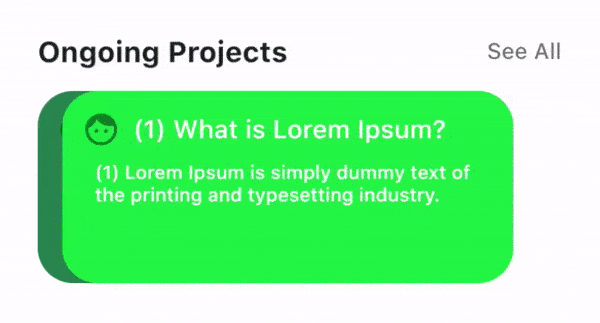

# Flutter Horizontal Featured List

A Flutter package to create Horizontal Featured List. It helps you in saving time during the development of many same designs. It will be useful for your awesome app.



### Example

```dart
import 'dart:math' as math;
import 'package:flutter_horizontal_featured_list/flutter_horizontal_featured_list.dart';

class _MyAppState extends State<MyApp> {
  List<Color> colors = List.generate(20, (index) => randomColor());

  @override
  Widget build(BuildContext context) {
    return MaterialApp(
      title: 'Example',
      theme: ThemeData(
        primarySwatch: Colors.blue,
      ),
      home: Scaffold(
        appBar: AppBar(
          title: Text('Example'),
        ),
        backgroundColor: Colors.white,
        body: Center(
          child: HorizontalFeaturedList(
            itemColorBuilder: (context, index) => colors[index],
            itemCount: colors.length,
            itemBuilder: (BuildContext context, int index) {
              return Column(
                children: [
                  Row(
                    children: <Widget>[
                      Icon(
                        Icons.face,
                        size: 24,
                        color: Colors.black45,
                      ),
                      Expanded(
                        child: Padding(
                          padding: const EdgeInsets.only(left: 8.0),
                          child: Text(
                            '($index) What is Lorem Ipsum?',
                            style: TextStyle(
                              fontSize: 16,
                              fontWeight: FontWeight.w500,
                            ),
                          ),
                        ),
                      ),
                    ],
                  ),
                  Expanded(
                    child: Padding(
                      padding: const EdgeInsets.all(8.0),
                      child: Text(
                        '($index) Lorem Ipsum is simply dummy text of the printing and typesetting industry.',
                        style: TextStyle(
                          fontSize: 12,
                        ),
                      ),
                    ),
                  ),
                ],
              );
            },
            onPressedItem: () {},
            onPressedSeeAll: () {},
            titleText: 'Ongoing Projects',
            seeAllText: 'See All',
          ),
        ),
      ),
    );
  }
}

Color randomColor() {
  var g = math.Random.secure().nextInt(255);
  var b = math.Random.secure().nextInt(255);
  var r = math.Random.secure().nextInt(255);
  return Color.fromARGB(255, r, g, b);
}
```

### Development environment

```
[✓] Flutter (Channel stable, 2.0.5, on macOS 11.2.3 20D91 darwin-x64, locale en-VN)
    • Flutter version 2.0.5
    • Framework revision adc687823a (11 days ago), 2021-04-16 09:40:20 -0700
    • Engine revision b09f014e96
    • Dart version 2.12.3

[✓] Android toolchain - develop for Android devices (Android SDK version 30.0.3)
    • Platform android-30, build-tools 30.0.3
    • Java binary at: /Applications/Android Studio.app/Contents/jre/jdk/Contents/Home/bin/java
    • Java version OpenJDK Runtime Environment (build 1.8.0_242-release-1644-b3-6915495)
    • All Android licenses accepted.

[✓] Xcode - develop for iOS and macOS
    • Xcode at /Applications/Xcode_12.app/Contents/Developer
    • Xcode 12.4, Build version 12D4e
    • CocoaPods version 1.10.1

[✓] Chrome - develop for the web
    • Chrome at /Applications/Google Chrome.app/Contents/MacOS/Google Chrome

[✓] Android Studio (version 4.1)
    • Android Studio at /Applications/Android Studio.app/Contents
    • Flutter plugin can be installed from:
      🔨 https://plugins.jetbrains.com/plugin/9212-flutter
    • Dart plugin can be installed from:
      🔨 https://plugins.jetbrains.com/plugin/6351-dart
    • Java version OpenJDK Runtime Environment (build 1.8.0_242-release-1644-b3-6915495)
```